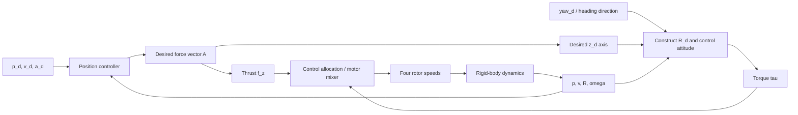

# Lecture 7 - Quadrotor Control

_MIT 16.485 Visual Navigation for Autonomous Vehicles study report based on Lecture 7: Quadrotor Control._

---

## Overview

Lecture 7 moves from the question **"How does a quadrotor move?"** in [[Lecture 6 - Quadrotor Model]] to **"How should thrust and torque be chosen so that a quadrotor tracks a trajectory?"** The lecture presents two design approaches:

1. **Geometric controller**: works directly with rotation matrices on $SO(3)$ and remains suitable for aggressive motion and large attitude changes.
2. **Near-hover cascaded PD controller**: linearizes the dynamics around hover. It is lightweight and easy to implement, but is reliable only when roll, pitch, and angular rates remain small.

The central constraint is that a quadrotor has only four independent actuator inputs but six configuration degrees of freedom. It cannot command an arbitrary translational acceleration and an arbitrary attitude at the same time. The controller therefore treats the following four quantities as the independently commanded outputs:

$$
\left(p^w,\psi\right)
\in \mathbb{R}^3 \times SO(2),
$$

These are the three position coordinates and one yaw direction. Desired roll and pitch are not independent commands; the controller generates them internally from the thrust direction required for position tracking.

> [!summary]
> The position controller determines the **desired thrust direction**, which in turn determines the desired roll and pitch. The attitude controller then rotates the vehicle so that its actual thrust axis tracks that direction, while yaw specifies the remaining orientation degree of freedom.

| Method | Model | Operating region | Main advantage | Main limitation |
| --- | --- | --- | --- | --- |
| Geometric control | Nonlinear dynamics on $SO(3)$ | Large-angle motion; almost-global attitude domain except for the $180^\circ$ relative-rotation set | Avoids Euler-angle singularities and supports aggressive motion | More involved derivation and implementation |
| Near-hover cascaded PD | Dynamics linearized around hover | A local neighborhood of hover with small roll, pitch, and angular rates | Lightweight, intuitive, and suitable for high-rate execution | Performance degrades away from hover |

## Control objective and coordinate frames

The notation continues the conventions used in [[Lecture 6 - Quadrotor Model]]:

| Symbol | Meaning |
| --- | --- |
| $p^w, v^w$ | Current position and velocity expressed in the world frame $w$ |
| $p_d^w, v_d^w, \ddot p_d^w$ | Desired position, velocity, and acceleration |
| $R_B^w=[x_B^w\ y_B^w\ z_B^w]$ | Current attitude; its columns are the body axes expressed in the world frame |
| $R_d^w=[x_d^w\ y_d^w\ z_d^w]$ | Desired attitude constructed by the controller |
| $\omega^B$ | Current angular velocity expressed in the current body frame |
| $\omega_d$ | Desired angular velocity expressed in the desired body frame |
| $\tilde{x}_d^w$ | Desired heading vector in the horizontal plane, used to specify yaw |
| $f_z^B$ | Scalar total-thrust command along the body $z_B$ axis |
| $\tau^B$ | Control torque expressed in the body frame |

The desired yaw direction can be written as

$$
\tilde{x}_d^w =
\begin{bmatrix}
\cos\psi_d \\
\sin\psi_d \\
0
\end{bmatrix}.
$$

| ![[attachments/lecture-7-current-desired-frames.png]] |
| :---: |
| Figure 7.1: The world frame, current body frame, and desired frame; $\tilde{x}_d^w$ specifies only the desired yaw direction in the horizontal plane. |

### Why can't all six degrees of freedom be selected independently?

Define the signed-square rotor-speed vector

$$
\bar w=
\begin{bmatrix}
w_1|w_1| & w_2|w_2| & w_3|w_3| & w_4|w_4|
\end{bmatrix}^T.
$$

> [!note]
> The geometric-model section writes rotor angular speed as $w_i$, while the near-hover section later uses $\omega_i$. By contrast, $\omega^B$ denotes the vehicle's body angular velocity. These are different physical quantities even though the symbols look similar.

Under the quadrotor model, the reduced allocation matrix $\bar F$ is invertible, so the controller can use scalar thrust and body torque as four **virtual control inputs**:

$$
\begin{bmatrix}
f_z^B \\
\tau^B
\end{bmatrix}
=
\bar F\,\bar w,
\qquad
\bar F\in\mathbb{R}^{4\times4}.
$$

The three components of $\tau^B$ control attitude, while $f_z^B$ scales the force along $z_B$. The thrust direction cannot be selected arbitrarily in the body frame; it is fixed by the vehicle's current attitude. To accelerate horizontally, the vehicle must tilt. Roll and pitch therefore become mechanisms for generating horizontal acceleration rather than independent objectives alongside position.

> [!warning]
> Demanding that a quadrotor simultaneously hold a fixed position and maintain an arbitrary roll or pitch is generally physically inconsistent. When the body tilts, thrust gains a horizontal component and the vehicle accelerates unless another force cancels it.

## From the dynamics model to control inputs

The dynamics derived in Lecture 6 can be rewritten using total thrust and torque as convenient inputs:

$$
\begin{bmatrix}
m\ddot p^w \\
J\dot\omega^B
\end{bmatrix}
=
\begin{bmatrix}
-mg e_3 \\
-\omega^B\times J\omega^B
\end{bmatrix}
+
\begin{bmatrix}
z_B^w & 0 \\
0 & I_3
\end{bmatrix}
\begin{bmatrix}
f_z^B \\
\tau^B
\end{bmatrix},
$$


where

$$
z_B^w=R_B^w e_3.
$$

Separating translation and rotation gives

$$
m\ddot p^w=-mg e_3+f_z^B z_B^w,
$$

$$
J\dot\omega^B=-\omega^B\times J\omega^B+\tau^B.
$$

This structure is the key to understanding the controller:

- The **translational channel** receives only the force vector $f_z^Bz_B^w$.
- The **rotational channel** directly receives the three torque components $\tau^B$.
- The motor mixer uses $\bar F^{-1}$ to convert $(f_z^B,\tau^B)$ into four signed-square rotor commands.

## Geometric controller

### Closed-loop architecture

| ![[attachments/lecture-7-geometric-control-loop.png]] |
| :---: |
| Figure 7.2: The position loop generates scalar thrust and the desired thrust direction; the attitude loop generates torque; control allocation maps these virtual inputs to the four rotors. |

The control flow can be read as follows:



The geometric controller resembles a PD controller, but its attitude error is defined on $SO(3)$ instead of being computed by directly subtracting Euler angles.

### Tracking errors

The position and velocity errors are

$$
e_p=p^w-p_d^w,
$$

$$
e_v=v^w-v_d^w.
$$

The rotation error is

$$
e_R=
\frac{1}{2}
\left[
(R_d^w)^T R_B^w
-(R_B^w)^T R_d^w
\right]^\vee.
$$

The angular velocity error is

$$
e_\omega
=
\omega^B
-(R_B^w)^T R_d^w\omega_d.
$$

> [!info]
> The $[\cdot]^\vee$ operator maps a skew-symmetric matrix in $\mathfrak{so}(3)$ to a vector in $\mathbb{R}^3$. This connects directly to [[Lecture 4 - Lie Groups]].

### Intuition for the rotation error $e_R$

Define the relative rotation from the desired frame to the current body frame as

$$
R_e=(R_d^w)^T R_B^w.
$$

Then

$$
e_R=\frac{1}{2}(R_e-R_e^T)^\vee.
$$

If $R_e$ is a rotation through angle $\theta$ around the unit axis $a$, Rodrigues' formula gives

$$
R_e-R_e^T=2\sin\theta\,[a]^\wedge,
$$

and therefore

$$
e_R=\sin\theta\,a.
$$

This result provides two useful intuitions:

1. Locally, the direction of $e_R$ identifies the correction axis, subject to the rotation and frame conventions used in the controller.
2. Near the desired attitude, $\sin\theta\approx\theta$, so $e_R\approx\theta a$ and behaves like an ordinary angular error vector.

The lecture also relates this expression to the logarithm map:

$$
\operatorname{dist}_\theta(R_d^w,R_B^w)
=
\left\|
\log\left((R_d^w)^T R_B^w\right)^\vee
\right\|,
$$

where

$$
\log(R)=
\begin{cases}
0, & R=I_3,\\[4pt]
\dfrac{\theta}{2\sin\theta}(R-R^T), & \text{otherwise}.
\end{cases}
$$

Thus, $e_R$ is a vector parametrization of the relative rotation. It differs from the log-map vector mainly by a scale factor that depends on $\theta$.

> [!warning]
> Because $e_R=\sin\theta\,a$, the error is also zero at a relative rotation of $\theta=\pi$. These $180^\circ$ attitudes are undesired critical points. The desired equilibrium is locally exponentially stable and attractive from almost all initial attitudes, while the stable manifolds of the undesired critical points form the excluded measure-zero set. This topological obstruction is why smooth feedback on $SO(3)$ cannot provide a truly global result.

### Intuition for the angular velocity error $e_\omega$

The expression $\omega^B-\omega_d$ cannot be used directly because the two vectors are expressed in different frames:

- $\omega^B$ is expressed in the current body frame $B$.
- $\omega_d$ is expressed in the desired body frame $d$.

The transformation

$$
(R_B^w)^T R_d^w\omega_d
$$

performs two steps:

1. $R_d^w\omega_d$ converts the desired angular velocity from frame $d$ to the world frame.
2. $(R_B^w)^T$ converts that vector from the world frame to the current body frame.

The subtraction becomes meaningful only after both quantities are expressed in frame $B$.

> [!tip]
> Before subtracting two geometric vectors, always ask: **Are they expressed in the same coordinate frame?**

## Geometric control law

Define the commanded world-frame force vector before enforcing the thrust-direction constraint:

$$
A
=
-k_p e_p-k_v e_v+mg e_3+m\ddot p_d^w,
$$

where $k_p,k_v,k_R,k_\omega>0$ are positive gains.

The controller selects the scalar thrust command

$$
f_z^B=A\cdot R_B^w e_3=A\cdot z_B^w,
$$

and the torque

$$
\tau^B
=
-k_R e_R-k_\omega e_\omega
+\omega^B\times J\omega^B
-J\left(
[\omega^B]^\wedge (R_B^w)^T R_d^w\omega_d
-(R_B^w)^T R_d^w\dot\omega_d
\right).
$$

The terms have the following roles:

| Term | Role |
| --- | --- |
| $-k_pe_p$ | Pulls the position toward the desired trajectory |
| $-k_ve_v$ | Damps velocity error |
| $mg e_3$ | Compensates for gravity |
| $m\ddot p_d^w$ | Provides desired-acceleration feedforward |
| $-k_Re_R$ | Restores the desired attitude |
| $-k_\omega e_\omega$ | Damps angular velocity error |
| $\omega^B\times J\omega^B$ | Cancels gyroscopic coupling in the rigid-body dynamics |
| Terms containing $\omega_d,\dot\omega_d$ | Feed forward the motion of the desired attitude |

### Constructing the desired attitude from force and yaw

Because thrust is constrained to the $z_B$ direction, the desired $z$ axis must align with $A$:

$$
z_d^w
=
\frac{A}{\|A\|}
=
\frac{-k_p e_p-k_v e_v+mg e_3+m\ddot p_d^w}
{\|-k_p e_p-k_v e_v+mg e_3+m\ddot p_d^w\|}.
$$

The controller then combines $z_d^w$ with the heading $\tilde{x}_d^w$ to construct an orthonormal basis:

$$
y_d^w
=
\frac{z_d^w\times\tilde{x}_d^w}
{\|z_d^w\times\tilde{x}_d^w\|},
$$

$$
x_d^w=y_d^w\times z_d^w,
$$

$$
R_d^w=
\begin{bmatrix}
x_d^w & y_d^w & z_d^w
\end{bmatrix}
\in SO(3).
$$

This construction reflects the physical priorities of the system:

1. Position tracking determines $z_d^w$, the direction needed to generate the desired acceleration.
2. The desired yaw selects the remaining orientation around $z_d^w$. More precisely, $x_d^w$ is the normalized projection of the heading direction $\tilde{x}_d^w$ onto the plane perpendicular to $z_d^w$.
3. The attitude controller makes $R_B^w$ track $R_d^w$.

The construction requires

$$
\|A\|\neq0
$$

and

$$
\|z_d^w\times\tilde{x}_d^w\|\neq0.
$$

If $A=0$, the desired thrust direction is undefined. If $z_d^w$ is parallel to $\tilde{x}_d^w$, their cross product is zero and the formula cannot construct $y_d^w$.

### Why does the thrust law work?

Temporarily suppose that the quadrotor could generate an arbitrary body-frame force vector. The ideal force would be

$$
f_{\mathrm{ideal}}^B
=(R_B^w)^T
\left(
-k_p e_p-k_v e_v+mg e_3+m\ddot p_d^w
\right).
$$

Substituting this force into the translational dynamics,

$$
m\ddot p^w=-mg e_3+R_B^w f_{\mathrm{ideal}}^B,
$$

gives

$$
m\ddot p^w
=
-k_p e_p-k_v e_v+m\ddot p_d^w.
$$

Since

$$
e_v=\dot e_p,
\qquad
\ddot e_p=\ddot p^w-\ddot p_d^w,
$$

the error dynamics become

$$
m\ddot e_p+k_v\dot e_p+k_p e_p=0.
$$

This is a stable second-order system when $k_p,k_v>0$.

In reality, a quadrotor can generate force only along $z_B^w$. The controller therefore takes the **projection** of $A$ onto the current thrust axis:

$$
f_z^B=A\cdot z_B^w.
$$

When $z_B^w=z_d^w$, the projection gives $f_z^B=\|A\|$. When an attitude error remains but the axes are less than $90^\circ$ apart, the dot product reduces thrust according to their alignment.

> [!warning]
> In the mathematical model, $f_z^B$ is a signed scalar. If $A\cdot z_B^w<0$, the requested force would point opposite the available thrust direction, which a standard fixed-pitch quadrotor cannot produce. A practical implementation must combine thrust saturation with an attitude-recovery strategy and feasible control allocation.

> [!summary]
> The position loop does not directly output roll and pitch. It produces a force vector $A$; the direction $A/\|A\|$ becomes the desired $z$ axis, while $A\cdot z_B^w$ is the scalar thrust command compatible with the current thrust axis.

### Why does the torque law work?

The rotational dynamics are

$$
J\dot\omega^B=-\omega^B\times J\omega^B+\tau^B.
$$

The $+\omega^B\times J\omega^B$ term in the controller exactly cancels the nonlinear coupling term in the plant. The remaining feedforward terms compensate for motion of the desired frame. After substituting the torque law into the dynamics and differentiating $e_\omega$, the lecture obtains

$$
J\dot e_\omega=-k_R e_R-k_\omega e_\omega.
$$

Near the desired attitude, $\dot e_R\approx e_\omega$, so the system behaves intuitively like a second-order PD controller: $k_R$ provides restoring action and $k_\omega$ provides damping. The important distinction is that the error is defined consistently on $SO(3)$.

### Conditions and stability interpretation

The lecture assumes

$$
\|-k_p e_p-k_v e_v+mg e_3+m\ddot p_d^w\|\neq0
$$

and that the desired trajectory satisfies the acceleration bound

$$
\|-mg e_3+m\ddot p_d^w\|<B
$$

for some $B>0$.

For the attitude subsystem, the zero-error equilibrium is locally exponentially stable and almost globally attractive, with the $180^\circ$ critical set excluded as discussed above. The translational error dynamics have the desired stable form when attitude tracking is exact. In the complete system, however, translation and attitude remain coupled: a large attitude error rotates the actual thrust away from $z_d^w$ and can degrade position tracking or violate the assumptions used in the proof. The full stability argument is given in the work of Lee, Leok, and McClamroch.

### Two sanity checks for the geometric controller

**Case 1: hovering at the desired position.** Suppose

$$
e_p=e_v=0,
\qquad
\ddot p_d^w=0,
\qquad
R_B^w=R_d^w=I_3.
$$

Then

$$
A=mg e_3,
\qquad
z_d^w=e_3,
\qquad
f_z^B=mg.
$$

If the angular velocity is also zero, then $e_R=e_\omega=0$ and $\tau^B=0$. The controller requests exactly the force needed to balance gravity and no rotational torque.

**Case 2: accelerating horizontally along $+x_w$.** If the $x$ component of $A$ is positive, then $z_d^w=A/\|A\|$ tilts toward $+x_w$. The attitude loop tilts the quadrotor in that direction, giving thrust a positive horizontal component and producing the desired acceleration. This example shows that roll and pitch are intermediate variables used to satisfy the position objective, not independent objectives.

## Near-hover cascaded PD controller

This section illustrates the classical approach of linearizing the dynamics around the hover state:

$$
p^w=p_0^w,
\qquad
\phi=\theta=0,
\qquad
\psi=\psi_0,
$$

$$
\dot p^w=0,
\qquad
\dot\phi=\dot\theta=\dot\psi=0.
$$

The small-angle assumptions are

$$
\cos\phi\approx1,
\qquad
\cos\theta\approx1,
\qquad
\sin\phi\approx\phi,
\qquad
\sin\theta\approx\theta.
$$

| ![[attachments/lecture-7-near-hover-control-loop.png]] |
| :---: |
| Figure 7.3: Nested position and attitude control loops for the near-hover controller. |

### Two control loops and their bandwidths

- The **inner attitude loop** uses the IMU to control $\phi,\theta,\psi$ and typically runs between $200\,\mathrm{Hz}$ and $2\,\mathrm{kHz}$.
- The **outer position loop** uses position and velocity estimates to generate a thrust adjustment and the roll/pitch commands needed for translational motion. Yaw is the remaining heading reference; it may be supplied independently or chosen from the path direction.

The attitude loop must be faster than the position loop because the outer loop assumes that attitude commands are followed sufficiently quickly.

### Hover equilibrium

For the symmetric, level-hover configuration assumed in the lecture, total thrust balances gravity and all four rotors share the load equally. The nominal thrust magnitude of each rotor is

$$
|T_{i,0}|=\frac{mg}{4}.
$$

With the thrust model $T_i=c_f\omega_i^2$, the nominal rotor speed is

$$
\omega_{i,0}=\omega_h
=
\sqrt{\frac{mg}{4c_f}}.
$$

> [!note]
> The sign of the thrust vector depends on the propeller and body-axis convention; the formula for $\omega_h$ uses the force magnitude required to balance gravity.

### Motor mixing around hover

Instead of directly controlling four rotor speeds, the controller uses four variables with clear physical meanings:

$$
\omega_h+\Delta\omega_F,
\qquad
\Delta\omega_\phi,
\qquad
\Delta\omega_\theta,
\qquad
\Delta\omega_\psi.
$$

For the quadrotor configuration used in the lecture, the mixing relation is

$$
\begin{bmatrix}
\omega_1^d\\
\omega_2^d\\
\omega_3^d\\
\omega_4^d
\end{bmatrix}
=
\begin{bmatrix}
1&1&-1&-1\\
1&1&1&1\\
1&-1&1&-1\\
1&-1&-1&1
\end{bmatrix}
\begin{bmatrix}
\omega_h+\Delta\omega_F\\
\Delta\omega_\phi\\
\Delta\omega_\theta\\
\Delta\omega_\psi
\end{bmatrix}.
$$

The variables have the following effects:

| Variable | Main effect |
| --- | --- |
| $\Delta\omega_F$ | Changes the total force along $z_B$ |
| $\Delta\omega_\phi$ | Produces a roll moment |
| $\Delta\omega_\theta$ | Produces a pitch moment |
| $\Delta\omega_\psi$ | Produces a yaw moment through differential rotor drag torque |

The corresponding inverse matrix is

$$
\begin{bmatrix}
\omega_h+\Delta\omega_F\\
\Delta\omega_\phi\\
\Delta\omega_\theta\\
\Delta\omega_\psi
\end{bmatrix}
=
\frac14
\begin{bmatrix}
1&1&1&1\\
1&1&-1&-1\\
-1&1&1&-1\\
-1&1&-1&1
\end{bmatrix}
\begin{bmatrix}
\omega_1^d\\
\omega_2^d\\
\omega_3^d\\
\omega_4^d
\end{bmatrix}.
$$

> [!warning]
> The sign pattern of the mixer depends on rotor numbering, rotor spin directions, and body-frame orientation. Do not copy this matrix to another platform without first checking its hardware conventions.

### Linearizing the attitude dynamics

Let

$$
\omega^B=
\begin{bmatrix}
p&q&r
\end{bmatrix}^T,
\qquad
J=\operatorname{diag}(J_{xx},J_{yy},J_{zz}).
$$

Assuming four arms of equal length $\|\rho^B\|$ and a body frame rotated by $45^\circ$ relative to the arm axes, the angular dynamics contain coupling terms such as $qr(J_{zz}-J_{yy})$, $pr(J_{xx}-J_{zz})$, and $pq(J_{yy}-J_{xx})$.

Near hover, the lecture neglects these terms because

- $r$ is small, so products containing $r$ are small.
- The quadrotor is nearly symmetric, so $J_{xx}\approx J_{yy}$.

After linearization around $\omega_h$, the relationship between rotor-speed changes and desired angular accelerations is

$$
\dot p_d
=
\frac{4\sqrt{\frac12}\,c_f\|\rho^B\|\omega_h}{J_{xx}}
\Delta\omega_\phi,
$$

$$
\dot q_d
=
\frac{4\sqrt{\frac12}\,c_f\|\rho^B\|\omega_h}{J_{yy}}
\Delta\omega_\theta,
$$

$$
\dot r_d
=
\frac{4c_d\omega_h}{J_{zz}}
\Delta\omega_\psi.
$$

> [!warning]
> Equation (7.40) in the PDF omits the coefficient $c_f$, although the pre-linearization pitch equation (7.36) includes it and the roll/pitch structure is symmetric. The pitch formula above therefore uses the symmetry-consistent form with $c_f$. This is an explicit editorial correction, not a verbatim transcription of (7.40).

Near the hover state,

$$
\dot\phi\approx p,
\qquad
\dot\theta\approx q,
\qquad
\dot\psi\approx r.
$$

The controller therefore uses three PD laws. In this subsection, $p_d$, $q_d$, and $r_d$ are desired **body-rate components**. In particular, the scalar $p_d$ here must not be confused with the desired position vector $p_d^w$ used elsewhere.

$$
\Delta\omega_\phi
=
k_{p,\phi}(\phi_d-\phi)
+k_{d,\phi}(p_d-p),
$$

$$
\Delta\omega_\theta
=
k_{p,\theta}(\theta_d-\theta)
+k_{d,\theta}(q_d-q),
$$

$$
\Delta\omega_\psi
=
k_{p,\psi}(\psi_d-\psi)
+k_{d,\psi}(r_d-r).
$$

The resulting $\Delta\omega$ values are passed through the mixer to obtain the four desired rotor speeds.

### Near-hover position control

For a trajectory with modest acceleration and nonzero desired speed, define the unit tangent at the desired point as

$$
\hat t
=
\frac{\dot p_d^w}{\|\dot p_d^w\|}.
$$

> [!warning]
> This definition is undefined when $\|\dot p_d^w\|=0$. At a stop or hover point, an implementation must retain a previous path frame, construct the tangent from the geometric path rather than velocity, or switch to a full position-error controller.

Choose $\hat n$ and $\hat b$ orthogonal to $\hat t$. The position error keeps only the part perpendicular to the tangent, known as the cross-track error:

$$
e_p
=
\left((p_d^w-p^w)\cdot\hat n\right)\hat n
+
\left((p_d^w-p^w)\cdot\hat b\right)\hat b.
$$

The equivalent matrix form is

$$
e_p
=
\left(I_3-\hat t\hat t^T\right)(p_d^w-p^w).
$$

The velocity error is

$$
e_v=\dot p_d^w-\dot p^w.
$$

> [!note]
> The near-hover section uses **desired minus current** errors, while the geometric controller earlier uses **current minus desired** errors. The feedback signs change accordingly: the near-hover acceleration law uses $+k_pe_p+k_de_v$, whereas the geometric law uses $-k_pe_p-k_ve_v$.

The commanded acceleration is generated using PD feedback plus feedforward:

$$
\ddot p_{\mathrm{cmd}}^w
=
k_p e_p+k_d e_v+\ddot p_d^w.
$$

This acceleration command is then converted into total thrust and desired angles $\phi_d,\theta_d,\psi_d$ for the attitude loop.

> [!warning]
> Equation (7.43) in the PDF appears to contain a malformed symbol in its second projection term. The expression above uses the same vector error $p_d^w-p^w$ along both $\hat n$ and $\hat b$, consistent with the sentence immediately after the equation: keep only the error in the normal plane and discard its component along $\hat t$.

### Why ignore the tangential position error?

If the main objective is to follow a **geometric path**, error along the tangent mainly indicates that the vehicle is ahead of or behind the trajectory parameterization. Cross-track error measures the actual displacement away from the path. This separation lets the controller correct the flight path without reacting too aggressively to progress error along it.

However, if the task requires precise time-parameterized trajectory tracking, discarding the tangential component may be inappropriate. In that case, the controller should also regulate timing error or use a full trajectory-tracking formulation.

## Comparison of the two controllers

| Aspect | Geometric controller | Near-hover cascaded PD |
| --- | --- | --- |
| Attitude representation | Rotation matrix $R\in SO(3)$ | Euler angles $\phi,\theta,\psi$ near hover |
| Attitude error | $e_R$ derived from relative rotation | Direct angle differences |
| Model | Nonlinear | Linearized |
| Feedforward | $\ddot p_d^w,\omega_d,\dot\omega_d$ | $\ddot p_d^w$ and desired rates |
| Coupling | Explicitly compensated in the torque law | Small coupling terms are neglected near hover |
| Large angles and aggressive motion | Suitable | Unsuitable |
| Implementation cost | Higher | Lower |
| Euler-angle singularities | Avoided | Still dependent on angle parametrization |
| Stability result | Almost-global attitude stability | Local behavior around hover |

> [!tip]
> A concise way to remember the distinction is: geometric control **respects the actual geometry of attitude**, while near-hover PD **reduces the problem to several small linear systems around one operating point**.

## Geometric controller implementation workflow

A practical control cycle can be organized as follows:

1. Receive the reference $p_d^w,v_d^w,\ddot p_d^w,\psi_d$ and, when available, $\omega_d,\dot\omega_d$.
2. Receive the state estimate $p^w,v^w,R_B^w,\omega^B$ from the estimator.
3. Compute $e_p$ and $e_v$.
4. Compute the desired force vector $A$.
5. Normalize $A$ to obtain $z_d^w$ and combine it with $\tilde x_d^w$ to construct $R_d^w$.
6. Compute $e_R$ and $e_\omega$ in consistent coordinate frames.
7. Compute $f_z^B$ and $\tau^B$.
8. Use the inverse mixer to compute

   $$
   \bar w
   =
   \bar F^{-1}
   \begin{bmatrix}
   f_z^B\\
   \tau^B
   \end{bmatrix}.
   $$

9. Recover rotor angular-speed commands from each signed-square entry, apply motor limits, verify that the requested force and torque are feasible, and send the commands to the motor controller.
10. Repeat at the selected control frequency.

### Conceptual pseudocode

```text
e_p = p - p_d
e_v = v - v_d

A = -k_p e_p - k_v e_v + m g e_3 + m a_d
z_d = normalize(A)
y_d = normalize(z_d cross x_heading_d)
x_d = y_d cross z_d
R_d = [x_d, y_d, z_d]

e_R = 0.5 * vee(R_d^T R - R^T R_d)
e_omega = omega - R^T R_d omega_d

f_z = A dot (R e_3)
tau = geometric_attitude_control(e_R, e_omega, omega_d, omega_dot_d)
rotor_signed_squares = inverse_mixer(f_z, tau)
rotor_speeds = signed_square_root(rotor_signed_squares)
```

For a signed-square value $\bar w_i=w_i|w_i|$, the inverse relation is

$$
w_i=\operatorname{sgn}(\bar w_i)\sqrt{|\bar w_i|}.
$$

On a conventional fixed-spin quadrotor, the admissible sign of each rotor is fixed by hardware, so infeasible mixer outputs must be handled by constrained allocation or saturation rather than by reversing a rotor arbitrarily.

## Gain interpretation and tuning intuition

When $k_p$ and $k_v$ are scalar gains, or when the axes are treated independently with diagonal gains, the ideal translational error dynamics along one axis are

$$
m\ddot e+k_v\dot e+k_p e=0.
$$

Comparing this expression with the standard second-order system

$$
\ddot e+2\zeta\omega_n\dot e+\omega_n^2 e=0
$$

gives the intuition

$$
\omega_n=\sqrt{\frac{k_p}{m}},
\qquad
\zeta=\frac{k_v}{2\sqrt{mk_p}}.
$$

- Increasing $k_p$ makes position response faster and stiffer.
- Increasing $k_v$ adds damping and reduces oscillation and overshoot.
- Excessively large gains can cause motor saturation, amplify noise, or excite unmodeled dynamics.
- The attitude loop should be faster than the position loop so that the thrust direction can follow the desired force vector.

Similar intuition applies to attitude only after local small-error approximation; each principal inertia $J_{ii}$ and the available torque limits must also be considered.

> [!warning]
> The continuous-time analysis assumes that the actuators reproduce the requested command. In a real system, motor saturation, slew-rate limits, delay, parameter errors in $m,J,c_f,c_d$, and state-estimation error can all invalidate the ideal behavior.

## Common conceptual mistakes

1. **Subtracting angular velocities expressed in different frames.** Transform $\omega_d$ into the current body frame before computing $e_\omega$.
2. **Using Euler-angle subtraction for large rotations.** It does not represent the geometry of $SO(3)$ correctly and can encounter singularities.
3. **Forgetting that thrust is constrained to $z_B$.** The position controller cannot request an arbitrary body-frame force.
4. **Treating the position and attitude loops as independent.** Attitude error directly changes the direction of translational force.
5. **Normalizing a vector near zero.** Check $\|A\|$ and $\|z_d\times\tilde x_d\|$ before division.
6. **Ignoring rotor conventions.** Mixer signs change with rotor numbering and spin direction.
7. **Using the near-hover controller for aggressive maneuvers.** Its small-angle assumptions and neglected coupling terms no longer hold.
8. **Ignoring actuator saturation.** The requested $(f_z,\tau)$ may lie outside the set of force-and-torque combinations achievable by the four motors.

## Key terms

| Term | Definition |
| --- | --- |
| Geometric control | Control designed directly on the state manifold, here $SO(3)$ or $SE(3)$ |
| Tracking error | Difference between the current and desired states |
| Attitude | Orientation of a rigid body, represented here by $R_B^w\in SO(3)$ |
| Almost-global stability | Convergence from almost every initial condition except a special unavoidable set |
| Feedforward | Control component computed from desired motion rather than measured error |
| Feedback | Control component that depends on measured tracking error |
| Control allocation | Mapping desired force and torque to individual actuator commands |
| Motor mixer | Matrix or algorithm that performs rotor control allocation |
| Cascaded control | Nested feedback loops, typically an inner attitude loop and outer position loop |
| Operating point | Nominal state around which a nonlinear system is linearized |
| Hover | Stationary flight in which total thrust balances gravity |
| Cross-track error | Position error component perpendicular to the trajectory tangent |
| Underactuated system | System with fewer independent control inputs than configuration degrees of freedom |

## Connections to other lectures and references

- [[Lecture 4 - Lie Groups]] provides $SO(3)$, the hat and vee operators, the log map, and rotation-distance concepts used to define $e_R$.
- [[Lecture 6 - Quadrotor Model]] provides the Newton-Euler dynamics, rotor thrust and drag models, the matrix $F$, and differential flatness. Lecture 7 uses that model directly to design feedback.
- Differential flatness from Lecture 6 explains the source of the reference $p_d^w,\psi_d$ and their derivatives; the controller in Lecture 7 converts that reference into actuator commands.
- [[Geometric Tracking Control of a Quadrotor UAV on SE(3)]] is the foundational work behind the geometric controller and the stability proof cited by the lecture.
- The later trajectory-optimization lectures generate the $p_d^w,v_d^w,\ddot p_d^w$ references required by the controller.

## Study checklist

- Explain why a quadrotor independently selects position and yaw rather than also selecting roll and pitch.
- Explain why $e_R$ uses the skew-symmetric part of the relative rotation.
- Explain why $\omega_d$ must be multiplied by $(R_B^w)^TR_d^w$ before computing $e_\omega$.
- Starting from $A$, construct $z_d^w,y_d^w,x_d^w$, and $R_d^w$ step by step.
- Explain why $f_z^B=A\cdot z_B^w$ is the appropriate projection under the actuator constraint.
- Identify which plant term is canceled by $\omega^B\times J\omega^B$ in the torque law.
- Explain why the geometric controller is almost globally, rather than globally, stable on $SO(3)$.
- List the assumptions used to neglect coupling terms in the near-hover controller.
- Describe how $\Delta\omega_F,\Delta\omega_\phi,\Delta\omega_\theta,\Delta\omega_\psi$ change the rotor-speed pattern.
- Explain when cross-track error is preferable to full position error.

## Final summary

> [!summary]
> - A quadrotor has four independent inputs, so it tracks position and yaw while roll and pitch are determined by the required thrust direction.
> - The geometric controller defines attitude error directly on $SO(3)$ and uses compensation and feedforward terms to produce simple tracking-error dynamics.
> - The position loop creates a force vector $A$; $A/\|A\|$ is the desired thrust axis, while $A\cdot z_B^w$ is the thrust that can currently be applied.
> - The near-hover controller linearizes around hover and uses an inner attitude PD loop with an outer position PD loop.
> - Geometric control is appropriate for aggressive motion, whereas near-hover PD has only local validity but is lightweight and easy to implement.

## References

1. Luca Carlone and Markus Ryll. _Lecture 7: Quadrotor Control_. MIT 16.485 Visual Navigation for Autonomous Vehicles, Fall 2023. [Lecture notes](https://vnav.mit.edu/material/07-Control2-notes.pdf).
2. Taeyoung Lee, Melvin Leok, and N. Harris McClamroch. "Geometric Tracking Control of a Quadrotor UAV on SE(3)." _49th IEEE Conference on Decision and Control_, 2010.
3. Samir Bouabdallah. _Design and Control of Quadrotors with Application to Autonomous Flying_. EPFL, 2007.
4. Daniel Gurdan et al. "Energy-efficient Autonomous Four-rotor Flying Robot Controlled at 1 kHz." _IEEE ICRA_, 2007.
5. Nathan Michael, Daniel Mellinger, Quentin Lindsey, and Vijay Kumar. "The GRASP Multiple Micro-UAV Testbed." _IEEE Robotics & Automation Magazine_, 2010.
