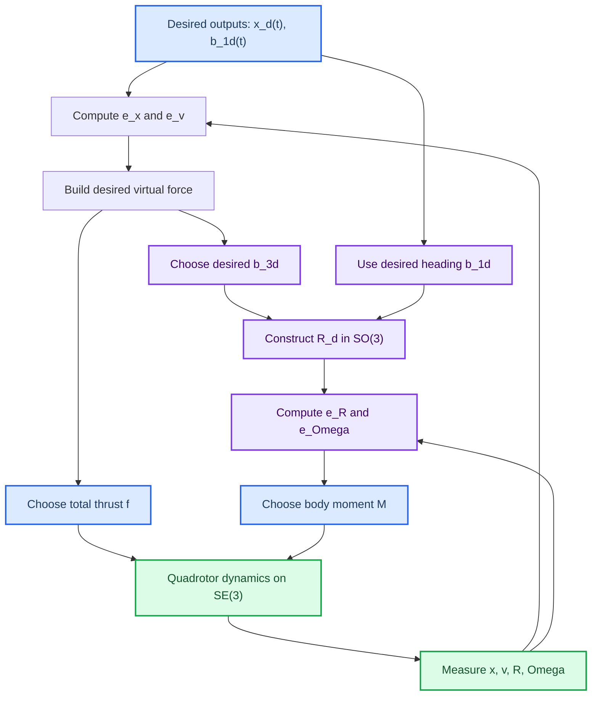

# Geometric Tracking Control of a Quadrotor UAV on SE(3)

_Study report for Taeyoung Lee, Melvin Leok, and N. Harris McClamroch, "Geometric Tracking Control of a Quadrotor UAV on SE(3)," IEEE CDC 2010._

---

## Overview

This paper develops a nonlinear tracking controller for a quadrotor directly on the configuration manifold $SE(3)$. The quadrotor state contains its position $x \in \mathbb{R}^3$, velocity $v \in \mathbb{R}^3$, attitude $R \in SO(3)$, and body-frame angular velocity $\Omega \in \mathbb{R}^3$. Instead of representing attitude with Euler angles or quaternions, the controller works directly with rotation matrices.

The main control objective is to track four outputs:

| Output                    | Meaning                         | Why only this many?         |
| ------------------------- | ------------------------------- | --------------------------- |
| $x_d(t) \in \mathbb{R}^3$ | Desired center-of-mass position | Three translational outputs |
| $b_{1d}(t)$               | Desired heading direction       | One rotational output       |

This is important because a quadrotor has four independent actuator inputs: the four rotor thrust magnitudes. Those inputs can control a desired position and one heading direction, but they cannot independently prescribe all six translational and rotational degrees of freedom at the same time.

> [!summary]
> The central idea is to use the desired position trajectory to choose the desired thrust direction, then use the desired heading direction to finish constructing a full desired attitude $R_d \in SO(3)$.

The paper's contribution is not merely another quadrotor controller. Its key point is geometric: the controller is defined intrinsically on $SE(3)$, avoiding coordinate singularities and quaternion sign ambiguity. This connects directly to [[Lecture 4 - Lie Groups]] and [[Lecture 6 - Quadrotor Model]].

## Why this paper matters

Many older quadrotor controllers were designed around local coordinates such as Euler angles. Those coordinates are convenient near hover, but they fail or become awkward for large-angle maneuvers because Euler angle charts have singularities. This paper instead uses $R \in SO(3)$, so every physically valid attitude is represented globally by a rotation matrix.

The paper also addresses a subtle issue with quaternion-based control. Unit quaternions double-cover $SO(3)$, meaning two antipodal quaternions represent the same physical attitude. If a controller does not handle that ambiguity carefully, it can command an unnecessary large rotation, a phenomenon often called unwinding.

> [!warning]
> "Global coordinates for attitude" does not mean "global asymptotic stability is possible." The topology of $SO(3)$ prevents any smooth controller from making every attitude converge globally to one equilibrium. This paper therefore proves almost-global properties.

For the MIT 16.485 sequence, this paper is a useful bridge:

| Related note | Connection |
| --- | --- |
| [[Lecture 4 - Lie Groups]] | Explains $SO(3)$, $SE(3)$, hat/vee maps, and why rotations live on manifolds |
| [[Lecture 6 - Quadrotor Model]] | Builds the quadrotor dynamics that this paper controls |
| [[Chapter 2 - 3D Rigid Body Motion]] | Gives background on rigid transforms and rotation matrices |
| [[Chapter 3 - Lie Group and Lie Algebra]] | Gives additional context for Lie groups and Lie algebras in robotics |

## Quadrotor model on $SE(3)$

### Coordinate frames and state

The paper chooses an inertial frame $\{i_1, i_2, i_3\}$ and a body-fixed frame $\{b_1, b_2, b_3\}$. The body frame origin is located at the quadrotor center of mass. The axes $b_1$ and $b_2$ lie in the rotor plane, while $b_3$ is normal to that plane and points opposite the total thrust direction.

|                    ![[attachments/lele-mc-2010-quadrotor-model.png]]                    |
| :-------------------------------------------------------------------------------------: |
| Figure 1: Quadrotor body frame, inertial frame, rotor locations, and thrust directions. |

The configuration is the pair $(x, R)$:

$$
x \in \mathbb{R}^3,
\qquad
R \in SO(3)
$$

where $R$ maps body-frame coordinates into inertial-frame coordinates. The full configuration manifold is

$$
SE(3) = \mathbb{R}^3 \rtimes SO(3)
$$

where $\rtimes$ indicates that translations and rotations combine as a semidirect product.

> [!info]
> The rotation matrix columns have physical meaning: $Re_1$, $Re_2$, and $Re_3$ are the body axes expressed in the inertial frame.

### Rotor thrusts and total inputs
Torque generated by $i$-th propeller:
$$
\tau_i
=
(-1)^{i} c_{\tau f} f_i
$$
$c_{\tau f}$ is a constant, from motor datasheet or calculate by measure torque and thrust`.
The primitive actuator quantities are the four rotor thrusts:

$$
f_1,\ f_2,\ f_3,\ f_4
$$

The paper repackages these into the total thrust $f$ and body-frame moment $M = [M_1, M_2, M_3]^T$:

$$
\begin{bmatrix}
f \\
M_1 \\
M_2 \\
M_3
\end{bmatrix}
=
\begin{bmatrix}
1 & 1 & 1 & 1 \\
0 & -d & 0 & d \\
d & 0 & -d & 0 \\
-c_{\tau f} & c_{\tau f} & -c_{\tau f} & c_{\tau f}
\end{bmatrix}
\begin{bmatrix}
f_1 \\
f_2 \\
f_3 \\
f_4
\end{bmatrix}
$$

Here $d$ is the arm length from the center of mass to a rotor, and $c_{\tau f}$ is the thrust-to-torque coefficient for propeller drag torque.

The determinant of this input matrix is

$$
det = 8c_{\tau f}d^2
$$

so the mapping is invertible when $d \neq 0$ and $c_{\tau f} \neq 0$. This lets the paper design controls in terms of $f$ and $M$, then recover individual rotor thrusts afterward.

> [!tip]
> Think of $f$ and $M$ as a cleaner control interface. The physical motors still produce $f_i$, but the analysis becomes simpler when the controller first chooses total thrust and body moment.

### Equations of motion

The rigid-body dynamics are:

$$
\dot{x} = v
$$

$$
m\dot{v} = mge_3 - fRe_3
$$

$$
\dot{R} = R\hat{\Omega}
$$

$$
J\dot{\Omega} + \Omega \times J\Omega = M
$$

The hat map is defined by

$$
\hat{x}y = x \times y
$$

for all $x,y \in \mathbb{R}^3$.

These equations separate naturally into translational and rotational parts:

| Equation                                | Meaning                                     |
| --------------------------------------- | ------------------------------------------- |
| $\dot{x}=v$                             | Position integrates velocity                |
| $m\dot{v}=mge_3-fRe_3$                  | Gravity plus thrust determines acceleration |
| $\dot{R}=R\hat{\Omega}$                 | Attitude evolves on $SO(3)$                 |
| $J\dot{\Omega}+\Omega \times J\Omega=M$ | Body moment determines angular acceleration |

The key underactuation is visible in the translational equation. The scalar $f$ sets the magnitude of thrust, but the thrust direction is tied to attitude through $Re_3$.

## Tracking objective

The desired trajectory contains:

$$
x_d(t)
$$

and

$$
b_{1d}(t)
$$

where $x_d(t)$ is the desired center-of-mass position and $b_{1d}(t)$ is the desired direction of the first body axis.

The controller should make:

$$
x(t) \to x_d(t)
$$

and make the projected body heading align with the projected desired heading:

$$
\operatorname{Proj}[b_1(t)] \to \operatorname{Proj}[b_{1d}(t)]
$$

where the projection is onto the plane normal to the desired $b_{3d}$ direction.

### Why heading is projected

The desired thrust direction fixes $b_{3d}$. Once $b_{3d}$ is chosen, the quadrotor still has one remaining rotational degree of freedom: yaw around $b_{3d}$. The desired vector $b_{1d}$ is used to choose that yaw-like degree of freedom.

But $b_{1d}$ might not already be perpendicular to $b_{3d}$. The controller therefore projects it onto the plane normal to $b_{3d}$.

|                                  ![[lele-mc-2010-heading.png]]                                  |
| :---------------------------------------------------------------------------------------------: |
| Figure 2: Desired heading is obtained by projecting $b_{1d}$ onto the plane normal to $b_{3d}$. |

> [!warning]
> The construction assumes $b_{1d}$ is not parallel to $b_{3d}$. If they are parallel, the cross product used to define $b_{2d}$ vanishes and the desired attitude is not well-defined.

## Controller structure

The controller can be understood as a cascade with feedback between translation and attitude:

The translation controller asks: "What force vector would make the position track?"

The attitude controller asks: "What attitude makes the quadrotor's thrust point in that force direction while matching the desired heading?"

The moment controller then makes $R$ follow that desired attitude.

## Tracking errors

### Position and velocity errors

The translational tracking errors are ordinary Euclidean errors:

$$
e_x = x - x_d
$$

$$
e_v = v - v_d
$$

where $v_d = \dot{x}_d$.

### Attitude error function

Because attitudes live on $SO(3)$, the paper does not subtract rotation matrices directly. It defines an attitude error function:

$$
\Psi(R,R_d) =
\frac{1}{2}\operatorname{tr}\left[I - R_d^T R\right]
$$

This error function has useful geometric meaning. If the relative rotation angle between $R$ and $R_d$ is $\theta$, then:

$$
\Psi = 1 - \cos \theta
$$

So:

| Attitude error angle | $\Psi$ value | Interpretation |
| --- | ---: | --- |
| $\theta = 0^\circ$ | $0$ | Correct attitude |
| $\theta = 90^\circ$ | $1$ | Boundary used for complete-system exponential stability |
| $\theta = 180^\circ$ | $2$ | Antipodal critical attitude |

The attitude error vector is obtained from the derivative of $\Psi$:

$$
e_R =
\frac{1}{2}
\left(
R_d^T R - R^T R_d
\right)^\vee
$$

The vee operator maps a skew-symmetric matrix back to a vector in $\mathbb{R}^3$.

### Angular velocity error

Angular velocities must be compared in a common tangent space. The desired angular velocity $\Omega_d$ is transported into the current body frame before subtraction:

$$
e_\Omega =
\Omega - R^T R_d \Omega_d
$$

> [!info]
> This is the geometric version of "subtract the desired angular velocity." The extra factor $R^T R_d$ matters because $\Omega$ and $\Omega_d$ are attached to different attitudes.

## The tracking controller

### Step 1: Build the desired translational force

The paper first defines the virtual force-like vector:

$$
A =
-k_x e_x - k_v e_v - mge_3 + m\ddot{x}_d
$$

This is what a fully actuated point mass would use to track the position trajectory.

If the quadrotor could directly apply any force $A$, the position controller would be straightforward. But the quadrotor can only apply thrust along $-Re_3$. Therefore the desired third body axis is chosen so that the thrust direction aligns with $A$:

$$
b_{3d}
=
-\frac{A}{\|A\|}
=
-\frac{-k_x e_x - k_v e_v - mge_3 + m\ddot{x}_d}
{\|-k_x e_x - k_v e_v - mge_3 + m\ddot{x}_d\|}
$$

The paper assumes:

$$
\|-k_x e_x - k_v e_v - mge_3 + m\ddot{x}_d\| \neq 0
$$

### Step 2: Complete the desired attitude

Once $b_{3d}$ is chosen, the heading direction supplies the remaining rotational degree of freedom:

$$
b_{2d}
=
\frac{b_{3d} \times b_{1d}}
{\|b_{3d} \times b_{1d}\|}
$$

Then the desired attitude is:

$$
R_d =
\begin{bmatrix}
b_{2d} \times b_{3d} &
b_{2d} &
b_{3d}
\end{bmatrix}
\in SO(3)
$$

This construction guarantees that $R_d$ is a valid rotation matrix with orthonormal columns.

> [!tip]
> The first column of $R_d$ is not simply $b_{1d}$. It is the normalized projection of $b_{1d}$ onto the plane perpendicular to $b_{3d}$.

### Step 3: Choose total thrust

The thrust command is:

$$
f =
-A \cdot Re_3
$$

Equivalently:

$$
f =
-\left(
-k_x e_x - k_v e_v - mge_3 + m\ddot{x}_d
\right)\cdot Re_3
$$

The dot product is crucial. If the current $b_3$ axis is aligned with the desired $b_{3d}$ axis, the thrust magnitude fully realizes the desired virtual force. If the attitude is badly misaligned, the thrust is reduced in a way that prevents the translational controller from blindly pushing in the wrong direction.

> [!summary]
> The thrust law is not just a position PD controller. It is a position controller filtered through the current attitude geometry.

### Step 4: Choose body moment

The moment command is:

$$
M =
-k_R e_R
-k_\Omega e_\Omega
+ \Omega \times J\Omega
-J\left(
\hat{\Omega}R^T R_d \Omega_d
-R^T R_d \dot{\Omega}_d
\right)
$$

The first two terms are proportional-derivative feedback on $SO(3)$. The remaining terms cancel or compensate the rigid-body rotational dynamics and the time-varying desired attitude.

The structure mirrors a familiar Euclidean tracking controller:

| Euclidean PD intuition | Geometric attitude version |
| --- | --- |
| Position error $x-x_d$ | Attitude error $e_R$ |
| Velocity error $\dot{x}-\dot{x}_d$ | Angular velocity error $e_\Omega$ |
| Feedforward acceleration | Desired angular acceleration and transport terms |
| Dynamics compensation | $\Omega \times J\Omega$ and $J(\cdots)$ terms |

## Why this controller is geometric

The controller is geometric because it never parameterizes the attitude with local coordinates. All attitude quantities are written using $R$, $R_d$, matrix products, the hat map, and the vee map.

This has three practical consequences:

1. The equations are valid for large rotations, not just small deviations from hover.
2. The controller avoids Euler-angle singularities.
3. The controller avoids quaternion double-cover ambiguity.

> [!info]
> This is the same lesson as [[Lecture 4 - Lie Groups#Lie group definition]]: when the state lives on a manifold, it is usually better to respect that manifold than to force everything into a single global vector coordinate chart.

## Stability results

The paper states three main results. The proofs are deferred to the authors' longer technical report, but the meaning of each result is clear.

### Proposition 1: attitude dynamics

For the attitude subsystem, the zero equilibrium of $(e_R,e_\Omega)$ is exponentially stable if:

$$
\Psi(R(0), R_d(0)) < 2
$$

and the initial angular velocity error satisfies the gain-dependent bound:

$$
\|e_\Omega(0)\|^2
<
\frac{2}{\lambda_{\max}(J)}
k_R
\left(
2-\Psi(R(0),R_d(0))
\right)
$$

The condition $\Psi<2$ means the initial attitude error is less than $180^\circ$. This covers almost all of $SO(3)$, excluding the exact antipodal critical attitudes.

### Proposition 2: complete position-attitude dynamics

For the full translational and rotational dynamics, exponential stability is guaranteed when:

$$
\Psi(R(0),R_d(0)) \leq \psi_1 < 1
$$

This means the initial attitude error is less than $90^\circ$.

Why does the full system need the stricter bound? Because the translational acceleration depends on the current thrust direction. If the attitude is too far away from the desired thrust direction, the thrust vector can point in a direction that temporarily hurts position tracking.

> [!warning]
> Attitude convergence alone is easier than full position-attitude convergence. The position dynamics inherit attitude error through the thrust direction $Re_3$.

### Proposition 3: almost-global exponential attractiveness

For larger initial attitude errors satisfying

$$
1 \leq \Psi(R(0),R_d(0)) < 2
$$

the paper proves exponential attractiveness of the complete tracking errors. The attitude error first decreases until it enters the $\Psi<1$ region, then the complete position-attitude stability result applies.

This gives the controller an almost-global region of attraction on $SO(3)$.

### Stability vocabulary

| Term                       | Meaning in this paper                                                                      |
| -------------------------- | ------------------------------------------------------------------------------------------ |
| Exponential stability      | Errors decay exponentially and the decay bound scales with the initial error               |
| Exponential attractiveness | Errors still decay exponentially after entering a suitable region, but the bound is weaker |
| Almost global              | All initial attitudes except a lower-dimensional set of problematic critical attitudes     |
| Critical attitude          | A point where the attitude error gradient vanishes even though the attitude is not correct |

The non-identity critical attitudes are rotations of $180^\circ$:

$$
R_d^T R = \exp(\pi \hat{v}),
\qquad
v \in S^2
$$

They form a two-dimensional subset of the three-dimensional attitude manifold $SO(3)$.

> [!summary]
> The controller is "almost global" because the bad initial attitudes exist mathematically, but they occupy a lower-dimensional subset of $SO(3)$ rather than a full-volume region.

## Step-by-step intuition for the difficult parts

### How position tracking creates an attitude command

1. Start with the desired position trajectory $x_d(t)$.
2. Compute position and velocity errors $e_x$ and $e_v$.
3. Build the virtual force $A=-k_xe_x-k_ve_v-mge_3+m\ddot{x}_d$.
4. Since thrust acts along $-Re_3$, choose $b_{3d}=-A/\|A\|$.
5. Use $b_{1d}$ to choose the remaining yaw-like degree of freedom.
6. Construct $R_d=[b_{2d}\times b_{3d}, b_{2d}, b_{3d}]$.
7. Use $M$ to drive $R \to R_d$.

The trick is that the translational controller does not command acceleration directly. It commands the attitude that makes the quadrotor's thrust point in the correct direction.

### Why the thrust uses a dot product

The desired virtual force is $A$, but the actual thrust force is constrained to the direction $-Re_3$. The controller chooses:

$$
f=-A\cdot Re_3
$$

Then the actual thrust contribution becomes:

$$
-fRe_3
=
(A\cdot Re_3)Re_3
$$

This is the projection of the desired force direction onto the current thrust axis. If $Re_3$ is wrong, the projection becomes smaller.

> [!tip]
> The dot product makes the translational controller attitude-aware. It prevents the controller from treating the quadrotor like a fully actuated point mass when the vehicle is rotated the wrong way.

### Why the controller cannot be truly global

The attitude error function has a correct minimum at $R=R_d$, but it also has non-identity critical points at $180^\circ$ rotations. This is not just a flaw in this particular formula. It reflects a deeper topological obstruction on $SO(3)$: no smooth feedback law can globally asymptotically stabilize every possible attitude to one target attitude.

This is why the paper is careful to claim almost-global exponential attractiveness rather than global asymptotic stability.

## Numerical examples

The paper gives two simulation cases using parameters based on a large quadrotor:

$$
J =
\begin{bmatrix}
0.0820 & 0 & 0 \\
0 & 0.0845 & 0 \\
0 & 0 & 0.1377
\end{bmatrix}
\ \mathrm{kg\,m^2}
$$

$$
m = 4.34\ \mathrm{kg},
\qquad
d=0.315\ \mathrm{m},
\qquad
c_{\tau f}=8.004\times 10^{-4}\ \mathrm{m}
$$

The controller gains are:

$$
k_x = 16m,
\qquad
k_v = 5.6m,
\qquad
k_R = 8.81,
\qquad
k_\Omega = 2.54
$$

### Case I: elliptic helix with rotating heading

The desired trajectory is:

$$
x_d(t) =
\begin{bmatrix}
0.4t \\
0.4\sin(\pi t) \\
0.6\cos(\pi t)
\end{bmatrix}
$$

and the desired heading is:

$$
b_{1d}(t) =
\begin{bmatrix}
\cos(\pi t) \\
\sin(\pi t) \\
0
\end{bmatrix}
$$

The initial attitude error satisfies the stronger $\Psi<1$ region, so Proposition 2 guarantees exponential stability of the complete tracking errors.

|                                            ![[lele-mc-2010-elliptic-helix.png]]                                             |
| :-------------------------------------------------------------------------------------------------------------------------: |
| Figure 3: Snapshots from the elliptic helix maneuver, showing large attitude changes along a nontrivial spatial trajectory. |

This example shows that the controller can track a trajectory requiring both translation and substantial rotation. A local hover-based linear controller would be much less natural for this case.

### Case II: recovery from nearly upside down

The second case starts the quadrotor almost upside down with an initial attitude error of about $178^\circ$. The desired trajectory is:

$$
x_d(t)=
\begin{bmatrix}
0 \\
0 \\
0
\end{bmatrix}
$$

and

$$
b_{1d}(t)=
\begin{bmatrix}
1 \\
0 \\
0
\end{bmatrix}
$$

The initial attitude error function is:

$$
\Psi(0)=1.995
$$

This is outside the $\Psi<1$ region needed for Proposition 2, but still inside $\Psi<2$. The attitude error decreases first. In the simulation, $\Psi$ becomes less than $1$ at about $0.88$ seconds, after which the complete tracking errors converge.

|                                                     ![[lele-mc-2010-upside-down.png]]                                                      |
| :----------------------------------------------------------------------------------------------------------------------------------------: |
| Figure 4: Snapshots from the recovery maneuver, where the quadrotor begins almost upside down and returns to the commanded hover attitude. |

> [!summary]
> The upside-down recovery example is the practical payoff of the geometric formulation: the controller remains meaningful even for a near-$180^\circ$ attitude error.

## Key terms

| Term | Definition |
| --- | --- |
| $SO(3)$ | The Lie group of $3 \times 3$ rotation matrices with determinant $1$ |
| $SE(3)$ | The rigid-body pose group combining translation and rotation |
| Hat map | The map $x \mapsto \hat{x}$ such that $\hat{x}y=x\times y$ |
| Vee map | The inverse of the hat map, mapping a skew-symmetric matrix to a vector |
| Attitude error function | A scalar function $\Psi(R,R_d)$ measuring mismatch between current and desired attitude |
| Attitude error vector | The vector $e_R=\frac{1}{2}(R_d^TR-R^TR_d)^\vee$ used for feedback |
| Angular velocity error | The transported difference $e_\Omega=\Omega-R^TR_d\Omega_d$ |
| Underactuation | A system has fewer independent controls than configuration degrees of freedom |
| Almost-global stability | Stability for all initial conditions except a lower-dimensional exceptional set |
| Unwinding | A quaternion controller commands a large unnecessary rotation because of quaternion sign ambiguity |

## Common confusions

### Is the quadrotor tracking a full attitude?

Not in the main formulation. It tracks position $x_d(t)$ and heading direction $b_{1d}(t)$. The desired attitude $R_d$ is constructed as an intermediate object so the thrust vector and heading direction are both satisfied.

### Why not just use Euler angles?

Euler angles are local coordinates. They are convenient near a chosen operating region, but they introduce singularities and complicated expressions for large rotations. This paper's goal is to handle aggressive maneuvers without those limitations.

### Why does $R_d$ depend on position error?

Because the desired thrust direction depends on the force needed to correct position error. If the vehicle is below or off the desired trajectory, the controller changes the desired $b_3$ direction so the thrust can accelerate the vehicle back toward the trajectory.

### Why is the result "almost global" instead of "global"?

Because $SO(3)$ has unavoidable topological constraints. Any smooth attitude controller on $SO(3)$ must have some undesired critical attitudes.

## Takeaways for visual navigation

This paper is a control paper, but it reinforces several ideas that also matter in visual navigation:

1. Pose representations are not interchangeable implementation details. They change the geometry of errors, derivatives, and controllers.
2. Rotation matrix columns directly encode body-axis directions, which can be exploited in control design.
3. Errors on $SO(3)$ and $SE(3)$ should respect the manifold structure, just as pose optimization in visual SLAM should use on-manifold updates.
4. The same hat and vee maps used in [[Lecture 4 - Lie Groups]] appear naturally in rigid-body dynamics and tracking control.
5. Quadrotor motion models from [[Lecture 6 - Quadrotor Model]] are not only for simulation; they determine which trajectories and feedback laws are physically meaningful.

> [!summary]
> The paper's deepest lesson is that respecting geometry gives cleaner equations, larger operating regions, and more physically interpretable controllers.

## Compact formula sheet

### Dynamics

$$
\dot{x}=v
$$

$$
m\dot{v}=mge_3-fRe_3
$$

$$
\dot{R}=R\hat{\Omega}
$$

$$
J\dot{\Omega}+\Omega\times J\Omega=M
$$

### Errors

$$
e_x=x-x_d,
\qquad
e_v=v-v_d
$$

$$
\Psi(R,R_d)=
\frac{1}{2}
\operatorname{tr}(I-R_d^TR)
$$

$$
e_R=
\frac{1}{2}
(R_d^TR-R^TR_d)^\vee
$$

$$
e_\Omega=
\Omega-R^TR_d\Omega_d
$$

### Desired attitude construction

$$
A=-k_xe_x-k_ve_v-mge_3+m\ddot{x}_d
$$

$$
b_{3d}=-\frac{A}{\|A\|}
$$

$$
b_{2d}=
\frac{b_{3d}\times b_{1d}}
{\|b_{3d}\times b_{1d}\|}
$$

$$
R_d=
\begin{bmatrix}
b_{2d}\times b_{3d} &
b_{2d} &
b_{3d}
\end{bmatrix}
$$

### Control inputs

$$
f=-A\cdot Re_3
$$

$$
M =
-k_Re_R
-k_\Omega e_\Omega
+\Omega\times J\Omega
-J(
\hat{\Omega}R^TR_d\Omega_d
-R^TR_d\dot{\Omega}_d
)
$$

## Suggested review questions

1. Why does the quadrotor track only position and heading instead of arbitrary position and arbitrary attitude?
2. How does the controller use $x_d(t)$ to construct $b_{3d}$?
3. Why is the desired $b_1$ direction projected onto the plane normal to $b_{3d}$?
4. What does $\Psi(R,R_d)=1$ mean geometrically?
5. Why does full position-attitude exponential stability require an initial attitude error less than $90^\circ$?
6. What is the difference between exponential stability and exponential attractiveness in this paper?
7. Why can no smooth controller on $SO(3)$ achieve true global asymptotic attitude stability?
8. How does this paper's use of $R \in SO(3)$ avoid Euler-angle singularities and quaternion unwinding?
